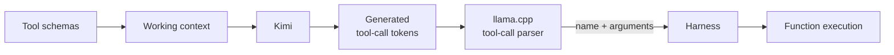
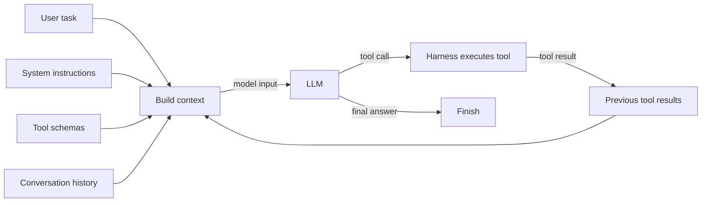
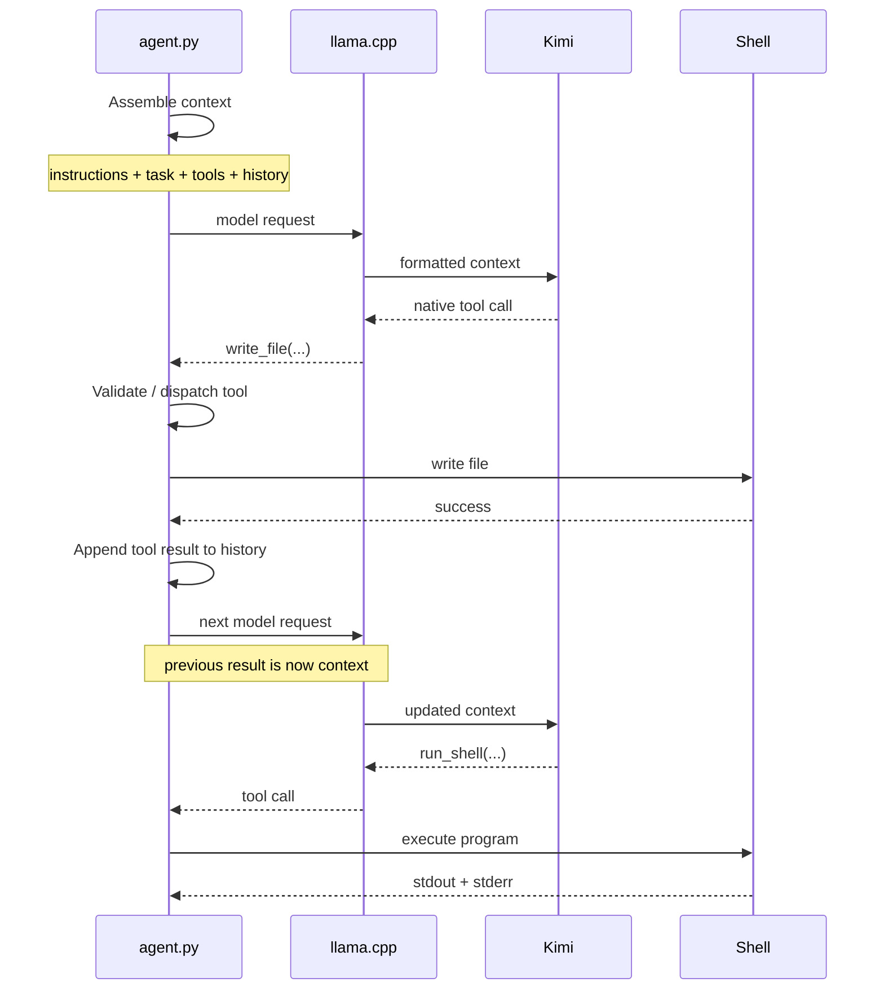

I recently realised I didn't really know how AI agents worked under the hood.
There are now plenty of agent frameworks, SDKs, protocols and other infrastructure.
They're all really large. See, for example, the [Codex repo](https://github.com/openai/codex).
That makes it easy to lose sight of the basic mechanism.
So I wanted to step back and answer a simple question:

**What is the minimum software required to turn an LLM into an agent?**

It turns out that the core loop is only a few dozen lines of Python.
This loop is normally referred to as a "harness".
Microsoft has a definition I like: an [agent harness](https://learn.microsoft.com/en-us/agent-framework/agents/harness) is "the scaffolding that turns a language model into an agent that can actually do things."

For this experiment I use [Kimi-Linear-48B-A3B-Instruct](https://huggingface.co/moonshotai/Kimi-Linear-48B-A3B-Instruct), served locally through `llama.cpp`.
Crucially, Kimi-Linear has a native tool-call template.
`llama.cpp` knows how to parse those tokens into a structured API response, and our harness decides whether anything actually runs, and how.
For more details and the full code see the accompanying GitHub repository [awennersteen/AI-agent-experiments](https://github.com/awennersteen/AI-agent-experiments).

[Take me directly to the code block](#agent-loop)

## An LLM cannot take actions

The key issue for having LLMs interact with the world is that, at the lowest level, an LLM still only generates tokens.
Give it some input and it predicts a sequence of output tokens.
By itself, it cannot read or write a file, execute code or call an API.

Instead, the model is told which tools are available and has been trained to generate a particular representation when it wants one of them invoked.
For example, we can tell the model that a tool exists:

```text
run_shell(command: string)
```

Given an appropriate task, Kimi might generate its native representation of something equivalent to:

```json
{
  "name": "run_shell",
  "arguments": {
    "command": "python test.py"
  }
}
```

Models with native tool calling, including Kimi K2, generate model-specific tool-call tokens that an inference server can parse into a structured `tool_calls` object.
The details are described in the [Kimi K2 tool-calling guidance](https://huggingface.co/moonshotai/Kimi-K2-Instruct-0905/blob/main/docs/tool_call_guidance.md) and the [vLLM tool-calling documentation](https://docs.vllm.ai/en/stable/features/tool_calling/).
In short, Kimi-Linear emits its model-specific representation, `llama.cpp` parses it into a structured tool call, and our harness decodes the arguments and executes it.



A better harness would also try to determine if the tool execution is safe, and if it's allowed to execute the tool.
But that is beyond the scope of this experiment.

## The harness builds the world the model sees and feels

The harness constructs the model's working context for each invocation.
That can contain the system instructions, user request, descriptions of available tools, previous model responses, previous tool calls and the results returned by those tools.
Maybe we can think of the harness in this sense as sensory system of the model, instructing it's brain (the LLM) what is in the world and what it can do.



This is important because the model only reasons over what appears in that context.
The harness constructs the world that the model sees:
- A shell command might return an error.
- A test might fail.
- Reading a file might reveal something unexpected.
Such result is added to the history and becomes part of the next model invocation, allowing the agent to try again or to fix it.

This is already the beginning of what is called [context engineering](https://www.anthropic.com/engineering/effective-context-engineering-for-ai-agents): deciding what information the model should have available at each step.

## Let's create our tiny agent

We'll need to setup an LLM and communicate with it, give it tools and create the agent loop.
The first part, setting up an LLM for local inference and sending it requests, is very standard and not instructive so you'll need to toggle them to appear below.

The accompanying GitHub repository [awennersteen/AI-agent-experiments](https://github.com/awennersteen/AI-agent-experiments) contains the full setup for how to install `llama-server`, which will automatically pull the model,
all the source code and a copy of this blog post.

<details markdown="1">
<summary>Setup</summary>

In short, install `llama.cpp` with the one liner
```bash
curl -LsSf https://llama.app/install.sh | sh
```

and start a local OpenAI-compatible server on port `8000`:

```bash
llama-server \
    -hf bartowski/moonshotai_Kimi-Linear-48B-A3B-Instruct-GGUF:Q3_K_M \
    -cmoe \
    -ngl all \
    -c 8192 \
    -a local-kimi \
    --port 8000
```

</details>

<details markdown="1">
<summary>Calling the LLM</summary>

To focus on the harness, we use the `openai` library from OpenAI to communicate with the REST API exposed by `llama-server` hosting the raw LLM.
We also provide a system prompt for this raw LLM, to help it understand its job better.

Below is the basic code needed to connect your Python code with the `llama-server` we just spun up.

```python
import os
from openai import OpenAI

MODEL = os.getenv("MODEL", "local-kimi")

client = OpenAI(
    base_url=os.getenv("OPENAI_BASE_URL", "http://localhost:8000/v1"),
    api_key="local",
)

SYSTEM_PROMPT = """You are a coding agent. Inspect before editing and verify your work.
Do not use git.
Do not finish a file-changing task until you have run the relevant code or tests successfully.
Treat any command with a nonzero exit code as a failure that must be fixed.
Verification must exit nonzero when a check fails; use assert, unittest, or pytest.
Use one tool at a time. When the task is complete, return a concise answer."""

messages = [
    {"role": "system", "content": SYSTEM_PROMPT},
    {"role": "user", "content": "TEST TASK TO VERIFY SETUP. Please answer 'READY'."},
]
response = client.chat.completions.create(
            model=MODEL,
            messages=messages,
            temperature=0,
            max_completion_tokens=4096,
)
message = response.choices[0].message
print(message)
```

</details>

### The Tools

We will give the model just three tools: read a file, write a file and execute a shell command.

These three are enough for this experiment.
In fact, a Linux shell can already provide most local capabilities itself.
Dedicated tools mainly give common operations a cleaner interface and, in a real implementation, can make them easier to control.

The [complete runnable agent](https://github.com/awennersteen/AI-agent-experiments/blob/main/01_harness/code/agent.py) defines ordinary Python functions for those operations, allowing them to be called from inside the Python harness.
It also sends their schemas with each model request:

```python
TOOLS = [
    {
        "type": "function",
        "function": {
            "name": "read_file",
            "description": "Read a text file in the workspace.",
            "parameters": {
                "type": "object",
                "properties": {"path": {"type": "string"}},
                "required": ["path"],
            },
        },
    },
    # write_file and run_shell follow the same shape
]
```

### The agent loop
<a id="agent-loop"></a>

```python
def agent(task, max_turns=20):
    messages = [
        {"role": "system", "content": SYSTEM_PROMPT},
        {"role": "user", "content": task},
    ]

    for _ in range(max_turns):
        response = client.chat.completions.create(
            model=MODEL,
            messages=messages,
            tools=TOOLS,
            tool_choice="auto",
            parallel_tool_calls=False,
            temperature=0,
            max_completion_tokens=4096,
        )
        message = response.choices[0].message
        messages.append(message.model_dump(exclude_none=True))

        if not message.tool_calls:
            return message.content or ""

        call = message.tool_calls[0]
        name = call.function.name
        try:
            arguments = json.loads(call.function.arguments)
            result = IMPLEMENTATIONS[name](**arguments)
        except Exception as error:
            result = f"TOOL ERROR: {type(error).__name__}: {error}"

        messages.append({
            "role": "tool",
            "tool_call_id": call.id,
            "content": result,
        })

    raise RuntimeError("Maximum turns exceeded")
```

The core part is in the `try ... except` block. having received a `tool_call` message from the LLM, we look up its `name`.
In order to execute the tool, we look up the callable function in the `IMPLEMENTATIONS` mapping, and pass the `**arguments` provided by the LLM. If that function call errors, it will raise a Python `Exception`, that we catch, and add as the `result`.
Otherwise, we use the `result` of the original function call.

In both cases, this is appended as a message to be returned to the LLM.
In the next iteration, the LLM can decide if the tool executed as expected or if it should fix it.

## Following one iteration

Suppose we ask:

```text
Solve the famous fizzbuzz challenge in fizzbuzz.py and run it for the first 20 integers
```

The interaction might look like this:

- The first model invocation might decide to create `fizzbuzz.py`.

- Our Python program performs the write and records the result.

- On the next invocation, Kimi sees that result and might decide to run the program.

- If the program fails, Kimi can inspect the failure based on the logs, edit the file, and run it again.

- Eventually, the program succeeds, and the LLM returns an ordinary assistant message instead of another tool request

In diagrammatic form:



If you want to see this yourself, I'd suggest to start by `print` the variable `message` in the method `agent`.

## What is actually doing what?

That is already an agent that can interact with the world and decide based on those external impulses.
And, there are only a few essential pieces to understand. Most importantly:

- **The model chooses the next action**  
  Whether that is a regular text response or a request to use a tool.

- **The tool schemas describe the actions available to it**  
  They are just JSONs with descriptions and parameters.

- **The harness executes requested actions**  
  This is where the LLM affects the outside world.

- **The harness constructs the working context**  
  The model's knowledge of the ongoing task comes from what the harness sends on each invocation.

- **The loop provides autonomy**  
  We do not decide manually which action follows each model response.

There is also an important authority boundary.
The model can request an action, but the harness decides whether that action actually happens.
In this tiny implementation, recognized tool calls are essentially trusted and executed.
A real harness can apply permissions or require approval first.

## What is missing?

Most obviously, safety, `subprocess.run(command, shell=True)` is not safe.
We do not stop the process accessing the rest of the host filesystem, network, credentials or other resources available to the Python process.

The context grows after every interaction.
File contents, shell output and previous tool calls all consume context.
Even with the large context windows of today, longer-running systems need to become selective about what they keep, retrieve or summarize.
Anthropic's [context engineering article](https://www.anthropic.com/engineering/effective-context-engineering-for-ai-agents) goes much further into that problem.
Notice that this is very different from how Retrieval Augmented Generation (RAG) was first done in the past, yet a similar idea.

Real coding agents also tend to expose more convenient operations.
For example, dedicated patching, editing and search tools can be much better interfaces, and less error prone, than repeatedly rewriting whole files.
But those tools do not change the underlying mechanism.

## Further reading

- **[Agent Harnesses, Microsoft Agent Framework](https://learn.microsoft.com/en-us/agent-framework/agents/harness)**  
  A good high-level definition of what an agent harness is. Microsoft's implementation goes well beyond the minimal loop here, which also makes it useful for seeing what gets added when moving from a toy harness towards a practical one.

- **[Building effective agents, Anthropic](https://www.anthropic.com/engineering/building-effective-agents)**  
  A particularly useful conceptual introduction. It argues for starting with simple, composable patterns and adding complexity only where it demonstrably helps.

- **[Effective context engineering for AI agents, Anthropic](https://www.anthropic.com/engineering/effective-context-engineering-for-ai-agents)**  
  Goes deeper into something the tiny harness mostly ignores: the model's context is finite, and deciding what information should occupy it becomes a problem of its own.

- **[The Codex App Server underlying Codex, OpenAI](https://openai.com/index/unlocking-the-codex-harness/)**  
  Zooming out, in order to re-use the harness in multiple products and allowing 3rd party extensions, OpenAI separated the Codex App Server containing the main harness from famous Codex CLI, IDE extensions, web app and macOS app.

- **[Tool Calling, vLLM](https://docs.vllm.ai/en/stable/features/tool_calling/)**  
  Useful implementation-level documentation for the inference server's parsing role. It explains how model-specific tool calls are exposed through an OpenAI-compatible API.

- **[Kimi K2 tool-calling guidance, Moonshot AI](https://huggingface.co/moonshotai/Kimi-K2-Instruct-0905/blob/main/docs/tool_call_guidance.md)**  
  Useful for looking one level below the API abstraction and seeing how Kimi represents tool calls and how an inference server is expected to parse them.
